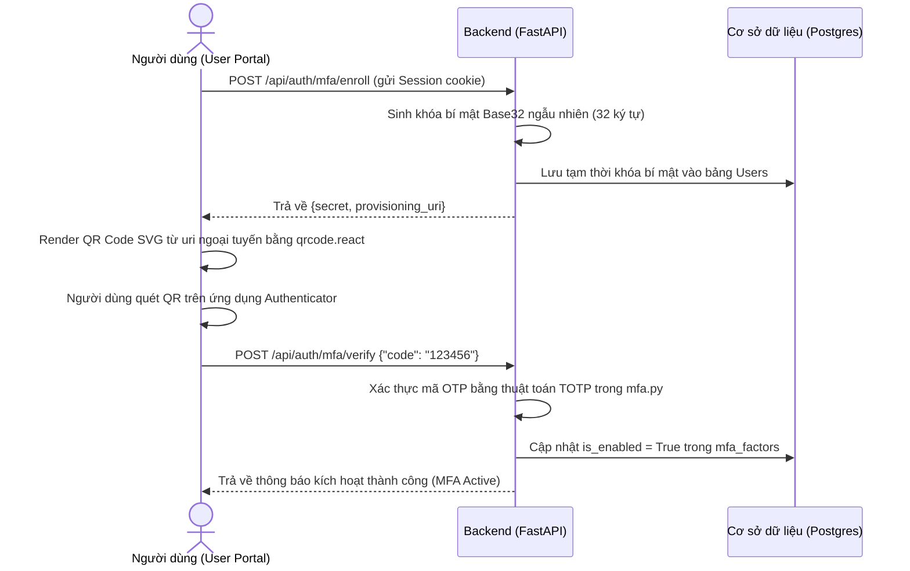
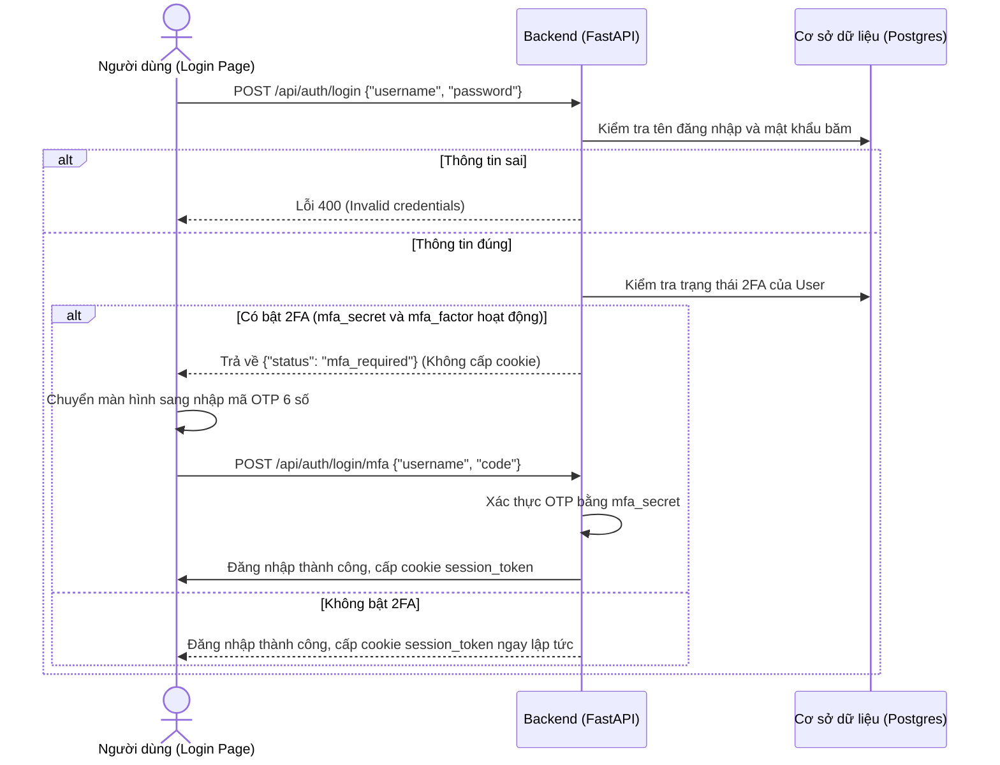

# Luồng Nghiệp Vụ & Kịch Bản Kiểm Thử Hệ Thống VPN

Tài liệu này chi tiết hóa các luồng nghiệp vụ (Workflows) chính trong hệ thống và danh sách các kịch bản kiểm thử (Test Cases) dùng để chạy demo và bảo vệ đồ án.

---

## A. CÁC LUỒNG NGHIỆP VỤ CHÍNH (SYSTEM WORKFLOWS)

### 1. Luồng đăng ký xác thực 2 lớp (MFA/2FA Enrollment)

### 2. Luồng đăng nhập hai bước (Two-Step Sign-In)

### 3. Luồng cấp phát & thu hồi VPN (VPN Provision & Revoke)
*   **Cấp phát**: Admin tạo profile cho user -> Hệ thống tự băm UUID của user thành địa chỉ IP `10.8.0.x` cố định -> Tạo cặp khóa WireGuard private/public/preshared -> Ghi nhận thao tác vào bảng nhật ký `audit_logs` -> User tải file cấu hình về.
*   **Thu hồi**: Admin nhấn nút "Revoke" -> Trạng thái profile chuyển sang `is_active = False` -> Cột `is_vpn_enabled` của user chuyển sang `False` -> Trình kiểm soát của User bị từ chối truy cập cấu hình VPN.

---

## B. KỊCH BẢN KIỂM THỬ (TEST CASES & VERIFICATION SCENARIOS)

Dưới đây là các kịch bản kiểm thử dùng để chứng minh tính đúng đắn và khả năng bảo mật của dự án khi demo trước giảng viên:

### Kịch Bản 1: Giới hạn tần suất đăng nhập (Rate Limiter)
*   **Mục tiêu**: Đảm bảo kẻ tấn công không thể gửi hàng nghìn yêu cầu đăng nhập mỗi giây.
*   **Các bước thực hiện**:
    1.  Gửi liên tiếp 6 yêu cầu đăng nhập sai thông tin qua API `/api/auth/login`.
*   **Kết quả mong đợi**:
    *   Từ yêu cầu thứ 1 đến thứ 5: Nhận về phản hồi lỗi mật khẩu `400 Bad Request`.
    *   Yêu cầu thứ 6: Nhận về phản hồi `429 Too Many Requests`. Ghi nhận sự kiện chặn trong nhật ký kiểm toán.

### Kịch Bản 2: Phát hiện Brute-Force & Kích hoạt Cảnh báo Bảo mật
*   **Mục tiêu**: Hệ thống tự động nâng cảnh báo khi có dấu hiệu dò quét tài khoản.
*   **Các bước thực hiện**:
    1.  Gửi 5 yêu cầu đăng nhập sai của tài khoản `nonexistent_user` từ cùng một địa chỉ IP trong vòng dưới 15 phút.
    2.  Đăng nhập tài khoản Admin hoặc Auditor vào hệ thống.
*   **Kết quả mong đợi**:
    *   Giao diện của Admin và Auditor hiển thị tăng chỉ số "Open Alerts".
    *   Trong cơ sở dữ liệu (hoặc bảng Alerts), xuất hiện dòng cảnh báo: `Possible brute-force login against nonexistent_user` với mức độ nghiêm trọng `high` (Cao) và trạng thái `open` (Chưa xử lý).

### Kịch Bản 3: Đăng nhập hai bước với tài khoản bật 2FA
*   **Mục tiêu**: Xác thực tính năng bảo mật hai lớp hoạt động chuẩn xác.
*   **Các bước thực hiện**:
    1.  Đăng nhập bằng tài khoản đã kích hoạt 2FA.
    2.  Hệ thống hiển thị ô nhập mã xác thực OTP.
    3.  Nhập sai mã OTP.
    4.  Nhập đúng mã OTP được hiển thị trên ứng dụng Google Authenticator trên điện thoại.
*   **Kết quả mong đợi**:
    *   Khi nhập sai mã OTP: Hệ thống báo lỗi `400 Invalid authentication code` và không cho vào Dashboard.
    *   Khi nhập đúng mã OTP: Đăng nhập thành công, chuyển hướng vào đúng giao diện Dashboard dành cho vai trò đó.

### Kịch Bản 4: Chống truy cập trái phép cấu hình VPN đã bị thu hồi
*   **Mục tiêu**: Đảm bảo người dùng bị khóa tài khoản hoặc thu hồi key không thể kết nối hoặc tải cấu hình VPN.
*   **Các bước thực hiện**:
    1.  Admin nhấn nút "Revoke" cấu hình VPN của tài khoản `vpnuser`.
    2.  Tài khoản `vpnuser` (hoặc kẻ tấn công sở hữu cookie của `vpnuser`) cố tình gửi yêu cầu tải cấu hình qua `/api/vpn/my-profile/config`.
*   **Kết quả mong đợi**:
    *   Yêu cầu tải cấu hình trả về lỗi `403 Forbidden` kèm thông báo `VPN access is not active`.
    *   Hệ thống tự động phát hiện hành vi cố tình truy cập này, ghi nhận sự kiện `revoked_user_access` mức độ trung bình (`medium`) và đẩy một Cảnh báo đe dọa (Alert) lên Dashboard của Admin.

### Kịch Bản 5: Thực thi Phân quyền vai trò (RBAC Check)
*   **Mục tiêu**: Đảm bảo tính riêng tư dữ liệu và phân tách trách nhiệm giữa các vai trò.
*   **Các bước thực hiện**:
    1.  Đăng nhập tài khoản vai trò `user` (ví dụ `vpnuser`).
    2.  Gửi yêu cầu GET tới `/api/audit` (Nhật ký kiểm toán) hoặc `/api/users` (Danh sách người dùng).
*   **Kết quả mong đợi**:
    *   Yêu cầu bị chặn lại ngay lập tức và trả về lỗi phân quyền `403 Forbidden`. Chỉ tài khoản có vai trò `admin` hoặc `auditor` mới có thể truy cập các đường dẫn này.
